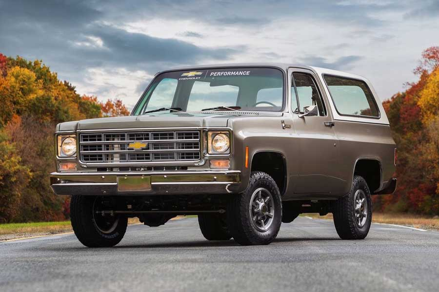
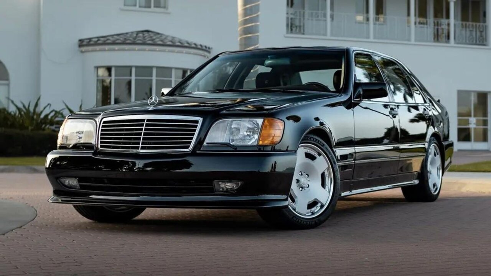

<!DOCTYPE html>
<html lang="fa">
<head>
  <meta charset="UTF-8">
  <title>ماشین‌های کلاسیک</title>

  
</head>

<body>

  <h1>ماشین‌های کلاسیک</h1>

  
  

    <a href="tel:09184485222" class="contact-btn">تماس با من</a>
   

     
     <h3 onclick="toggleText(this)">بلیزر</h3>
   
     

       بلیزر یک SUV کلاسیک آمریکاییه که برای آفرود ساخته شده.
       بدنه قدرتمند، طراحی خشن و حس نوستالژی باعث شده هنوز هم
       بین عاشقای ماشین‌های کلاسیک محبوب باشه.
     

   

    

      
      <h3 onclick="toggleText(this)">بنز اتاق تانک</h3>
    
     

       بنز اتاق تانک نماد دوام و مهندسی آلمانیه.
       ماشینی که برای سال‌ها کار ساخته شده و هنوز هم
       کیفیت و اصالتش زبان‌زد خاص و عامه.
     

    

    
    
    <button class="prev" onclick="prevSlide()">❮</button>
    <button class="next" onclick="nextSlide()">❯</button>
  

  
  

    ✖️
    
  

  

</body>
</html>
